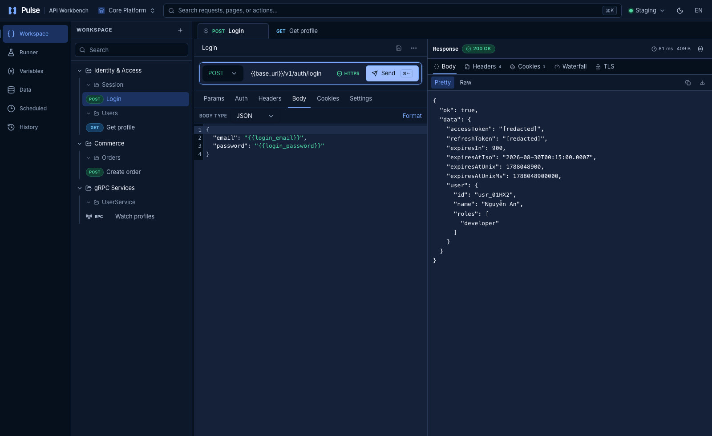

<p align="center">
  
</p>

<h1 align="center">Pulse API Workbench</h1>

<p align="center">
  A frontend-only internal API workbench for inspecting HTTP, gRPC, authentication, lifecycle,
  dataset, and concurrency workflows in one deterministic simulation.
</p>

<p align="center">
  <a href="LICENSE"></a>
  
  
</p>

<p align="center">
  Build, simulate, and inspect API workflows from one local workspace.
</p>

<p align="center">
  
</p>

## Quick start

Requires Node.js `^22.13.0` or `>=24.0.0` and npm.

```bash
cd website
npm ci
npm run dev
```

No backend, Docker service, or external account is required.

## Quality

```bash
cd website
npm run verify
npm run test:browser # install once: npx playwright install chromium
npm run test:a11y
npm audit --audit-level=high
```

Every pull request runs format, strict types, lint, tests, browser and accessibility checks,
architecture and bundle budgets, dependency review, and a final PR report.

## Project

Pulse ships with a deterministic local `ExecutionClient`; it has no API proxy, real transport,
load generator, or backend E2E. Persisted diagnostics and history are redacted; tokens and secret
values remain memory-only.

[Architecture](docs/architecture.md) · [Testing](docs/testing.md) · [Security model](docs/security-model.md) · [Roadmap](ROADMAP.md)

## Contributing

See [CONTRIBUTING.md](CONTRIBUTING.md) and [CODE_OF_CONDUCT.md](CODE_OF_CONDUCT.md). Report security
concerns via [SECURITY.md](SECURITY.md), not public issues.

## License

[Apache License 2.0](LICENSE).
